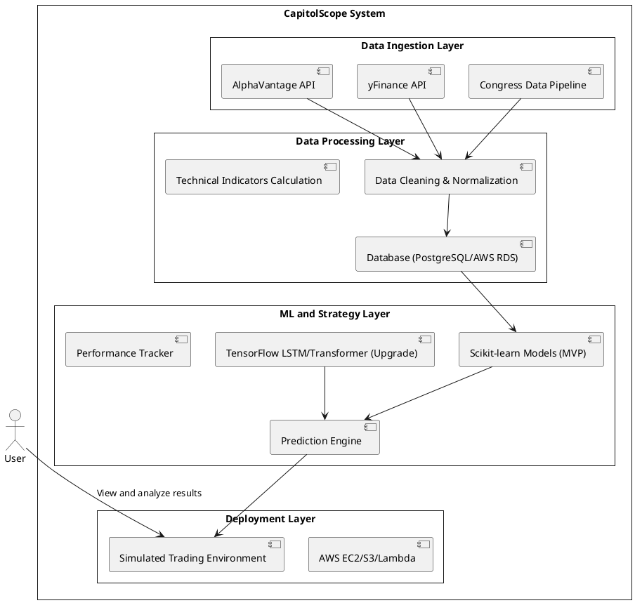

### **Method: Data Flow, Architecture, and Machine Learning**

#### **Data Flow Overview**

The data flow can be broken into three stages:

1. **Data Ingestion**:
    
    - Pull stock price and indicator data from APIs (e.g., AlphaVantage, yFinance).
    - Retrieve and process Congress trading data using your custom dataflow pipeline.
    - Ensure data normalization and cleaning for consistent processing.
2. **Data Processing**:
    
    - Use pandas/NumPy to apply transformations and compute technical indicators.
    - Store historical and processed data in a relational database for easy querying (e.g., PostgreSQL or AWS RDS).
3. **Modeling and Insights**:
    
    - Train a machine learning model using stock data and Congress trades as features.
    - Generate trading signals and track model performance.
    - Visualize trends, indicators, and model outputs.
4. **Deployment**:
    
    - Host the data processing and ML components on AWS (e.g., Lambda, EC2, S3).
    - Set up a simulated trading environment for strategy backtesting and analysis.

---

#### **Machine Learning Implementation**

##### **MVP Approach with Scikit-learn**

1. **Data Preprocessing**:
    
    - Feature Engineering:
        - Lagged features (e.g., previous `n` days’ prices, volume, indicators).
        - Rolling averages (7-day, 14-day, 30-day) for smoothing trends.
        - Volatility measures (e.g., rolling standard deviation, Bollinger Bands).
    - Congress Data Integration:
        - Create features such as:
            - Binary indicators for recent Congress trades.
            - Aggregated trades by sector or volume-weighted scores.
2. **Model Training and Testing**:
    
    - Use Scikit-learn for classical models like:
        - Random Forest for feature importance analysis.
        - XGBoost or LightGBM for efficient GPU-accelerated gradient boosting.
    - Evaluate models with metrics:
        - Regression: Mean Absolute Error (MAE), Root Mean Square Error (RMSE), R².
        - Classification: Precision, Recall, F1-score.
3. **Backtesting**:
    
    - Simulate trading strategies using model predictions.
    - Compare performance against historical benchmarks.

---

##### **Upgrade Path to TensorFlow**

1. **Enhanced Data Preprocessing**:
    
    - Sequence Data Preparation:
        - Reshape input into sequences for time-series models ([n_timesteps, n_features]).
        - Normalize features with `MinMaxScaler` or `StandardScaler`.
2. **Deep Learning Model Design**:
    
    - Start with LSTM or GRU networks:
        - Input: Sequential stock price and Congress data.
        - Output: Regression (price prediction) or classification (buy/sell signals).
    - Transition to advanced models like transformers for temporal dependencies.
3. **GPU Utilization**:
    
    - Set up TensorFlow with GPU support on your RTX 3080.
    - Use accelerated training to handle large datasets or advanced models.
4. **Deployment**:
    
    - Save TensorFlow models in `.h5` or `SavedModel` format.
    - Deploy using AWS services like Lambda, EC2, or TensorFlow Serving.

---

#### **System Architecture**

Here’s a high-level architecture diagram:

---

#### **Technologies and Tools**

- **Languages**: Python (pandas, NumPy, Scikit-learn for MVP, TensorFlow for upgrade).
- **Databases**: PostgreSQL or AWS RDS.
- **Cloud Services**: AWS (EC2, S3, Lambda).
- **APIs**: AlphaVantage, yFinance, custom Congress data source.